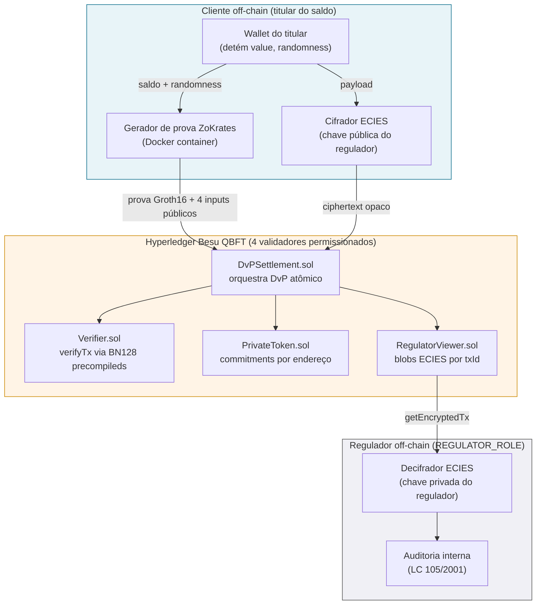
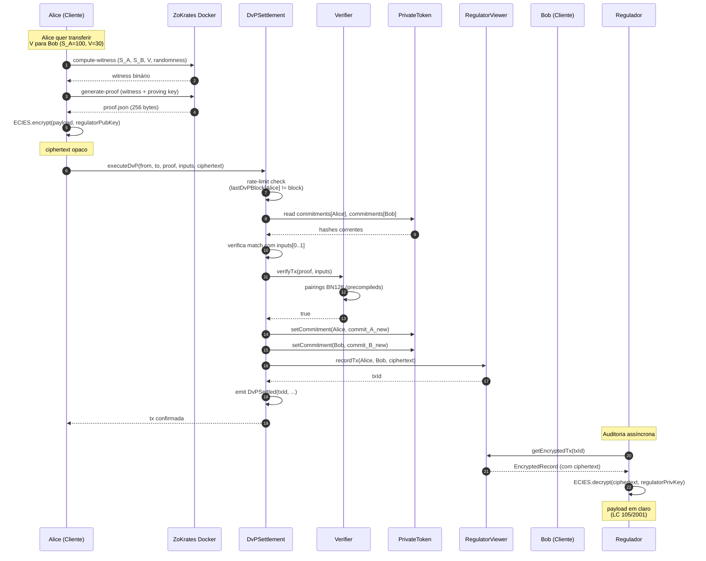
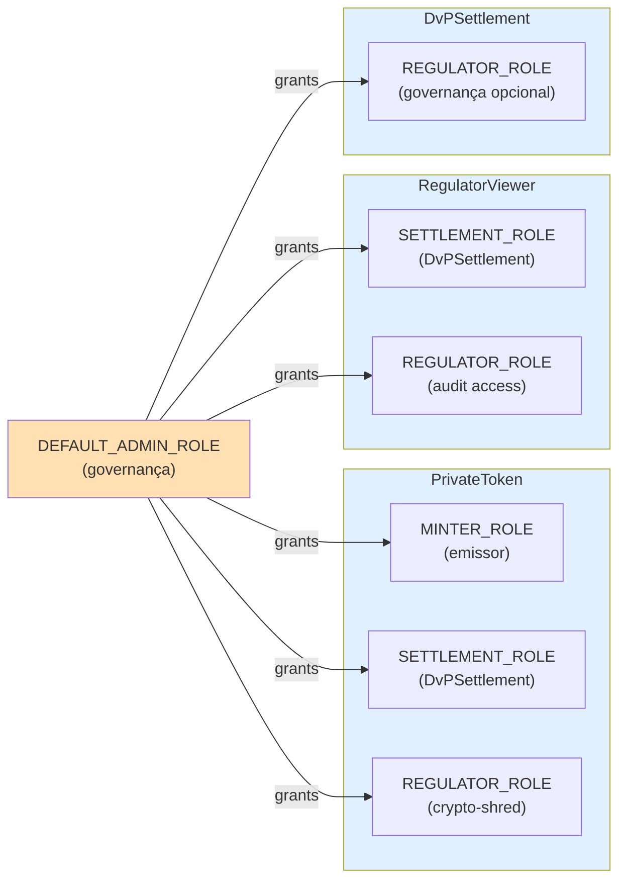

# Arquitetura — PoC DREX-ZKP-LGPD

> **TCC** — Privacidade em Sistemas Financeiros Distribuídos: Uso de Zero-Knowledge Proofs e Smart Contracts para Conformidade com a LGPD
> **Autor:** Henrique Lamarca | **Orientador:** Tassio Ferenzini Martins Sirqueira | **Período:** 2026/1

---

## Visão geral

A PoC organiza-se em **três camadas** com fronteiras de confiança bem delimitadas:



**Trust boundaries** (linhas pontilhadas):
- Cliente → Besu: dados em trânsito sobre TLS (configurável); apenas commitments e prova trafegam
- Besu → Regulador: nenhum tráfego direto — regulador consulta on-chain
- Cliente ↔ Regulador: indireto via blob ECIES armazenado no Viewer

---

## Componentes

### Camada 1 — Cliente off-chain

| Componente | Responsabilidade | Tecnologia |
|---|---|---|
| **Wallet do titular** | Armazena `(value, randomness)` por commitment; assina transações | ECDSA (secp256k1, padrão Ethereum) |
| **Gerador de prova** | Calcula witness + gera prova Groth16 | ZoKrates 0.8.8 via Docker (sem instalação no host) |
| **Cifrador ECIES** | Empacota metadados de transação para o regulador | ECIES real sobre secp256k1 (ECDH + HKDF + AES-256-GCM, lib `eciesjs`) |

**Por que off-chain:** geração de prova é computacionalmente cara (~2s) e exige acesso à randomness privada. **Manter off-chain é exigência de privacidade**, não otimização.

### Camada 2 — Hyperledger Besu QBFT (4 validadores)

| Contrato | Responsabilidade | Estado relevante |
|---|---|---|
| **`Verifier.sol`** | Valida prova Groth16 via precompileds BN128 (0x06/0x07/0x08) | Stateless (verification key embutida em constants) |
| **`DvPSettlement.sol`** | Orquestra a transação atômica: verify → update commitments → record audit | `lastDvPBlock[payer]` para rate limit |
| **`PrivateToken.sol`** | Armazena commitments e expõe operações de mint/update/shred | `commitments[address] -> bytes32` |
| **`RegulatorViewer.sol`** | Armazena blobs cifrados para o regulador | `_records[txId] -> EncryptedRecord` (privado), `txCount` |

Detalhes das responsabilidades, eventos e validações estão nos próprios contratos (cada função tem comentário NatSpec com referência ao artigo LGPD que materializa) e em [`docs/THEORY_CODE_IS_LAW.md`](THEORY_CODE_IS_LAW.md) (análise jurídica linha-a-linha).

### Camada 3 — Regulador off-chain

| Componente | Responsabilidade | Vínculo regulatório |
|---|---|---|
| **Decifrador ECIES** | Recupera payload original a partir do blob no Viewer | LC 105/2001 (sigilo bancário) |
| **Auditoria interna** | Registra acesso, motivo e responsável (off-chain) | LGPD art. 6º, X (responsabilização) |

---

## Fluxo de dados — DvP típico

Sequência completa de uma transferência DvP de Alice para Bob:



**Pontos críticos do fluxo:**

1. **Steps 1–4 (off-chain):** geração da prova é local; nenhum dado sensível trafega na rede ainda
2. **Step 5:** chamada `executeDvP` é a única interface pública — calldata contém apenas a prova, 4 hashes e o blob cifrado
3. **Steps 6–10:** validação atômica; qualquer falha reverte tudo
4. **Steps 11–14 (atualização):** estado é alterado em uma única transação — não há janela inconsistente
5. **Steps 15–18 (auditoria):** desacoplado temporalmente; regulador audita quando necessário

---

## Decisões arquiteturais (rastreio para ADRs)

| Aspecto | Decisão | ADR |
|---|---|---|
| Esquema zk | Groth16 sobre BN128 | [ADR-0001](ADR/0001-groth16-vs-plonk-vs-stark.md) |
| Plataforma de blockchain | Hyperledger Besu QBFT (4 validadores) | [ADR-0002](ADR/0002-besu-qbft-vs-fabric.md) |
| Tratamento do trusted setup | Local na PoC; MPC em produção | [ADR-0003](ADR/0003-trusted-setup-handling.md) |
| Esquema de commitment | Poseidon hash (revisão da decisão original) | [ADR-0004](ADR/0004-pedersen-vs-hash-commitment.md) |
| Crypto-shredding e art. 18 VI LGPD | Zerar commitment + audit trail; produção exige rotação de viewing key | [ADR-0005](ADR/0005-cryptoshredding-vs-art-18-VI.md) |

---

## Modelo de papéis (AccessControl)



**Recomendações para produção:**
- Substituir `DEFAULT_ADMIN_ROLE` por **multi-sig** 3-de-5 institucional
- Adicionar **time-lock** de 7 dias para concessão/revogação de papéis
- **Auditoria pública** dos eventos `RoleGranted`/`RoleRevoked`

Detalhes em [`docs/THREAT_MODEL.md`](THREAT_MODEL.md) (categoria S2 — Spoofing do regulador).

---

## Atendimento aos requisitos não-funcionais

| RNF | Descrição | Atendimento | Validação |
|---|---|---|---|
| **RNF01** | Geração de prova < 30s | **~2s** (15× melhor) | `benchmark/results/results.csv` |
| **RNF02** | Gas verifyTx < 300.000 | **264.020** (12% folga) | `benchmark/results/results.csv` |
| **RNF03** | Cobertura de testes ≥ 80% | **100% statements / 91.3% branches** | `npm run coverage` |
| **RNF04** | Build reprodutível via `make all` | OK em < 10 min | [`docs/REPRODUCIBILITY.md`](REPRODUCIBILITY.md) |
| **RNF05** | Determinismo do trusted setup documentado | OK | [ADR-0003](ADR/0003-trusted-setup-handling.md) |
| **RNF06** | Logs estruturados sem expor inputs privados | OK — validação programática | `scripts/05_run_dvp_demo.ts` |

---

## Estrutura de diretórios

```
.
├── circuits/                  Circuito ZoKrates + setup outputs
│   ├── solvency_dvp.zok       Predicado DvP (1.728 constraints)
│   ├── commit_helper.zok      Helper para fixtures de teste
│   └── proving_key/           Gerado por make zkp:setup (gitignored)
├── contracts/                 Contratos Solidity
│   ├── PrivateToken.sol       Custom commitment store
│   ├── DvPSettlement.sol      Orquestrador atômico
│   ├── RegulatorViewer.sol    Audit trail cifrado
│   └── Verifier.sol           Auto-gerado pelo ZoKrates
├── scripts/                   Scripts de build, deploy e demo
│   ├── 01_setup_zkp.sh        Pipeline ZoKrates (compile + setup + export)
│   ├── 02_test_zkp.sh         Smoke test off-chain
│   ├── 03_generate_test_fixtures.sh   Gera fixtures para Hardhat
│   ├── 04_deploy.ts           Deploy dos 4 contratos + concessão de papéis
│   └── 05_run_dvp_demo.ts     Cenário ponta-a-ponta
├── test/
│   ├── unit/                  Testes unitários (37/37 passing)
│   ├── integration/           Teste E2E in-process (6/6 passing)
│   └── fixtures/              Helpers + fixtures de prova
├── benchmark/
│   ├── benchmark.ts           Mede tempo, gas, tamanho
│   └── results/               CSV com cabeçalho de specs
├── besu-network/              Hyperledger Besu QBFT 4 nós
│   ├── docker-compose.yml
│   ├── init.sh                Gera chaves + genesis na 1ª subida
│   └── start-node.sh          Entrypoint dos validadores
├── docs/
│   ├── THEORY_CODE_IS_LAW.md  Cryptolaw + análise linha-a-linha
│   ├── LGPD_COMPLIANCE.md     Matriz princípio LGPD ↔ controle
│   ├── THREAT_MODEL.md        STRIDE com 18 ameaças
│   ├── ARCHITECTURE.md        Este documento
│   ├── REPRODUCIBILITY.md     Guia de reprodução em < 10 min
│   ├── USAGE.md               Guia prático de operação
│   ├── ADR/                   Registros de decisões (0001–0005)
│   └── figures/               Diagramas SVG dos componentes e benchmark
├── deployments/               JSON com endereços por rede (gitignored)
├── .github/workflows/ci.yml   Lint + typecheck + test + coverage
├── hardhat.config.ts          viaIR habilitado, BN128 evmVersion london
├── Makefile                   make all, besu:up, zkp:setup, deploy, demo, etc.
└── README.md                  Visão geral
```
